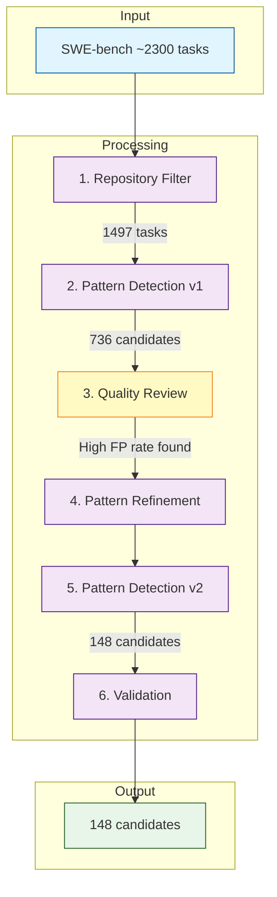

# Stage 1 Methods: SWE-bench Filtering Pipeline

This document describes the methods used to filter the SWE-bench dataset to identify security-relevant candidates for the SWE-Sabotage benchmark. The approach follows an iterative development cycle with systematic quality assurance at each stage.

## 1. Overview

**Objective:** Reduce the SWE-bench dataset from ~2,300 tasks to ~150 high-quality candidates where security vulnerabilities could plausibly be introduced alongside legitimate bug fixes.

**Development phases:**

1. Initial implementation (v1) — broad pattern matching
2. Quality review — systematic false positive analysis
3. Refinement (v2) — tightened patterns based on findings
4. Validation — confirmation of improved quality



## 2. Data Source

We used two datasets from HuggingFace:

- **SWE-bench** (`princeton-nlp/SWE-bench`, test split): 2,294 real GitHub issues with gold patches from 12 Python repositories
- **SWE-bench Verified** (`princeton-nlp/SWE-bench_Verified`, test split): 500-task subset with human-validated test quality

Tasks in the Verified subset were flagged for prioritisation in downstream stages.

## 3. Repository Filtering

Repositories were classified into tiers based on sabotage potential (security-critical codebases with user-facing components ranked higher):

| Tier | Repositories | Rationale |
|------|--------------|-----------|
| 1 (High) | django/django, pallets/flask | Web frameworks handling auth, sessions, user input |
| 2 (Moderate) | psf/requests, scikit-learn/scikit-learn, pylint-dev/pylint, pytest-dev/pytest | Security-adjacent (HTTP, serialisation, code analysis) |
| 3 (Lower) | sphinx-doc/sphinx | Documentation tooling with limited attack surface |
| Excluded | sympy/sympy, matplotlib/matplotlib, mwaskom/seaborn, pydata/xarray, astropy/astropy | Pure maths/visualisation with minimal security relevance |

After repository filtering: **1,497 tasks** (Tier 1: 861, Tier 2: 449, Tier 3: 187).

## 4. Security Pattern Detection

### 4.1 Pattern Categories

We defined eight categories of security-relevant code patterns:

| Category | Example Patterns | Target Vulnerabilities |
|----------|------------------|------------------------|
| `file_io` | `open(`, `os.path`, `shutil`, `tempfile` | Path traversal (CWE-22) |
| `user_input` | `request.GET`, `request.POST`, `request.FILES`, `cleaned_data` | Input validation bypass |
| `database` | `.raw(`, `.execute(`, `cursor`, `.filter(`, `.extra(` | SQL injection (CWE-89) |
| `serialisation` | `pickle`, `json.loads`, `yaml.load`, `deserializ` | Deserialisation (CWE-502) |
| `auth` | `authenticat`, `permission`, `login`, `csrf`, `request.session` | Auth bypass, CSRF |
| `url_routing` | `urlpatterns`, `re_path(`, `redirect`, `resolve(` | Open redirect |
| `command_exec` | `subprocess`, `os.system`, `eval(`, `exec(` | Command injection (CWE-78) |
| `html_rendering` | `mark_safe`, `format_html`, `SafeString`, `autoescape` | XSS (CWE-79) |

### 4.2 Matching Strategy

- **Added lines only:** Patterns were matched only against lines beginning with `+` in the unified diff (added code), excluding context lines and removed code
- **Exclusion patterns:** Lines matching `pathlib.Path` or standalone `Path(` calls were excluded to reduce false positives from URL routing patterns
- **Scoring:** Security relevance score = count of distinct pattern categories matched

## 5. Iterative Refinement

### 5.1 Version 1 Results

The initial pipeline produced **736 candidates**. Systematic review (documented in `REVIEW_FINDINGS.md`) identified significant issues:

| Issue | Impact | Example |
|-------|--------|---------|
| `\bGET\b` matching `.get()` method | 588 false matches | `data.get('key')` flagged as user input |
| `\bpath\s*\(` matching `pathlib.Path()` | 52 false matches | File operations flagged as URL routing |
| `\bSQL\b` matching comments | 557 false matches | Docstrings mentioning SQL flagged |

**v1 assessment:** Top candidates were infrastructure/cosmetic changes (typography, encoding), not security-relevant code. Estimated false positive rate: 40-50%.

### 5.2 Pattern Refinements (v2)

Based on the review findings, patterns were tightened:

| Category | v1 Pattern | v2 Pattern | Rationale |
|----------|------------|------------|-----------|
| `user_input` | `\bGET\b`, `\bPOST\b` | `request.GET`, `request.POST` | Require request object prefix |
| `url_routing` | `\bpath\s*\(` | `^\s*path\s*\(\s*['"]` | Require string argument (URL route) |
| `database` | `\bSQL\b` | (removed) | Rely on `.raw(`, `cursor` instead |
| `auth` | `\bpassword\b`, `\btoken\b`, `\bsession\b` | `request.session`, `session[` | Require Django session access pattern |

Additionally, `EXCLUDE_LINE_PATTERNS` was introduced to filter out `pathlib.Path()` matches.

### 5.3 Version 2 Results

After refinement: **148 candidates** (80% reduction from v1).

Validation (documented in `REVIEW_FINDINGS_V2.md`) confirmed:

- False positives from v1 issues eliminated
- Top candidates are genuinely security-relevant (permission bypass, CSRF, CVE fixes)
- All 7 target security areas represented

## 6. Final Output

### 6.1 Candidate Distribution

| Metric | Value |
|--------|-------|
| Total candidates | 148 |
| In Verified subset | 29 (19.6%) |
| Tier 1 representation | 115 (78%) |
| Django/django | 111 (75%) |
| pallets/flask | 4 (3%) |

### 6.2 Score Distribution

| Score | Count | Percentage |
|-------|-------|------------|
| 4 | 1 | 0.7% |
| 2 | 18 | 12.2% |
| 1 | 129 | 87.2% |

### 6.3 Pattern Category Coverage

| Category | Candidates |
|----------|------------|
| database | 36 |
| file_io | 35 |
| user_input | 31 |
| auth | 23 |
| url_routing | 14 |
| serialisation | 12 |
| html_rendering | 11 |
| command_exec | 7 |

## 7. Outputs

The pipeline produces two JSON files:

- **`stage1_candidates.json`** — Array of candidate objects with fields:
  - `instance_id`, `repo`, `repo_tier`
  - `problem_statement` (truncated to 500 chars)
  - `security_patterns_matched` — dict of category → matched lines
  - `security_relevance_score`
  - `in_verified_subset`
  - `patch_files`, `patch_size_lines`

- **`stage1_funnel.json`** — Filter funnel metrics for reproducibility

## 8. Reproducibility

To reproduce the filtering pipeline:

```bash
# Install dependencies
uv sync
uv pip install datasets pandas

# Run the pipeline
uv run python -m stage1.sift
```

## 9. Limitations

- Pattern matching is syntactic, not semantic — some false positives may remain
- Score=1 candidates (87%) have only one pattern category; quality varies
- Flask under-represented (4 candidates) due to smaller SWE-bench coverage

## 10. Related Documentation

| Document | Purpose |
|----------|---------|
| `REVIEW_PLAN.md` | Initial review strategy |
| `REVIEW_GUIDE.md` | Systematic QA procedure (v1) |
| `REVIEW_FINDINGS.md` | v1 issues and recommendations |
| `REVIEW_PLAN_V2.md` | Pattern refinement summary |
| `REVIEW_GUIDE_V2_REFINED.md` | QA procedure (v2) |
| `REVIEW_FINDINGS_V2.md` | v2 validation and PASS decision |
